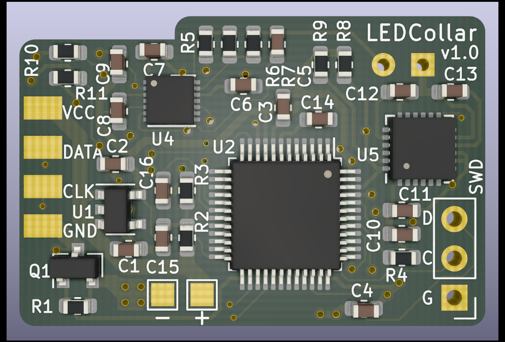
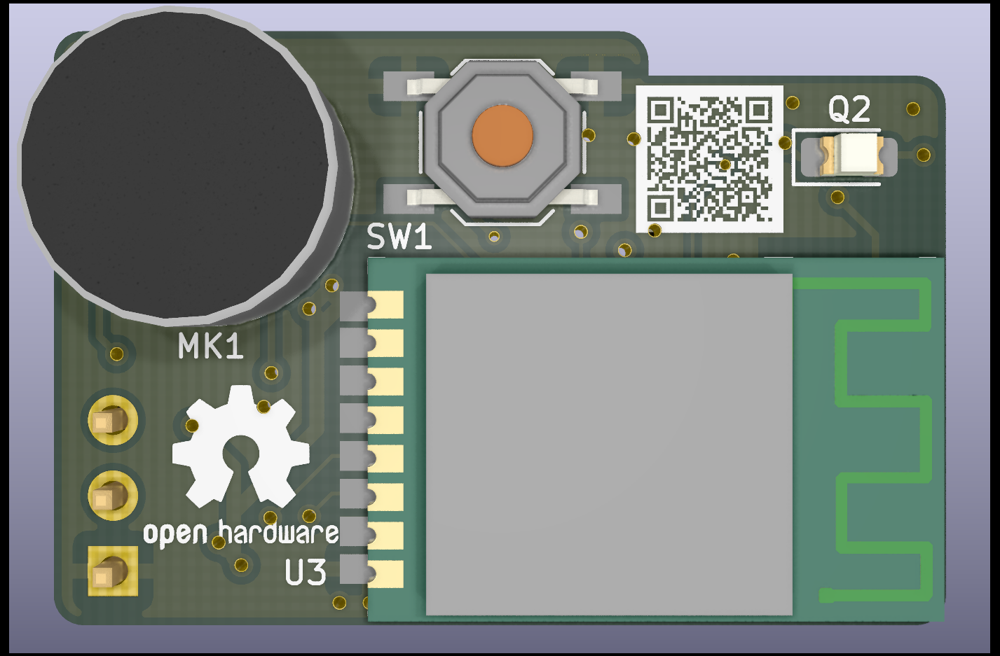
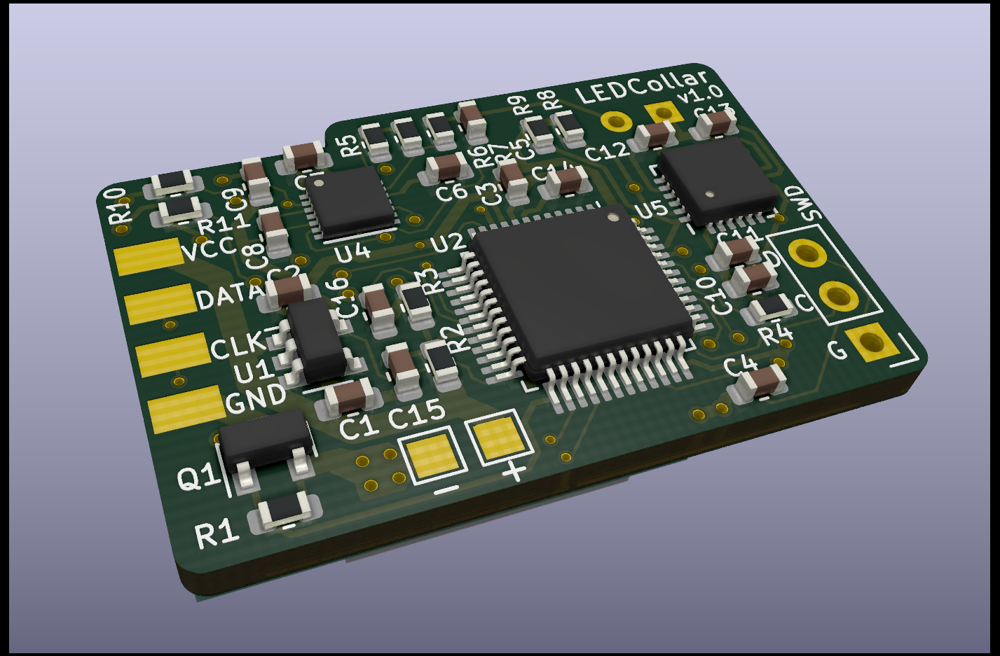

# LED Collar PCB

### [Interactive BOM](https://leodj.github.io/ledCollar/ledCollar_PCB/doc/ledCollar_PCB-ibom.html)

## Pictures

|  |  |
| --- | --- |
|  |  |

## Project Installation
Make sure to run git clone with --recurse-submodules to include the necessary libraries too.